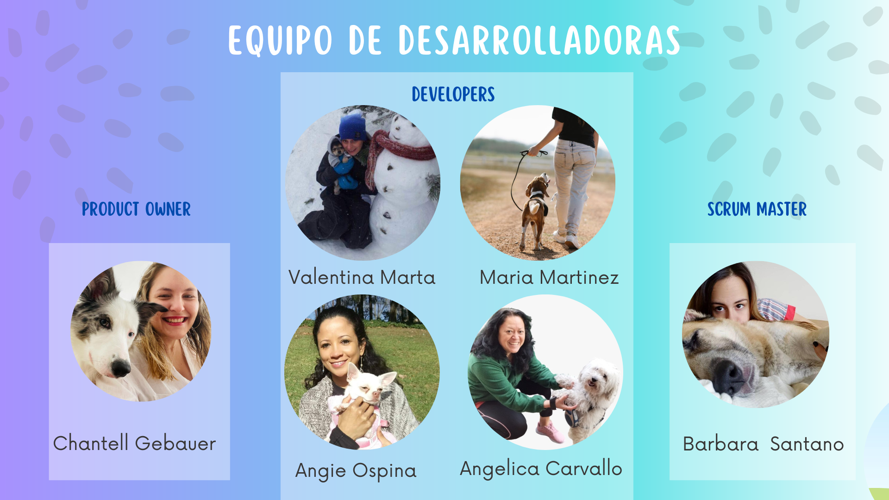

# Aplicación de una página responsive para Dejando Huella Albacete,con Back desarrollado en Symfony y Front en React desacoplados,  que cumple con la ley de Cookies y esta SEO optimizada.
[Demo]

## !🔌 Instala dependencias:
______ 

### `npm install react-icons` 
### `nmp install react-bootsrap bootstrap` 
### `npm install react-cookie-consent --force` 
### `npm i react-router-dom --save` 
### `npm install emailjs-com`
### `npm install react-cookie-consent`

Ejecútalo con:
### `nmp install`
### `npm start`

Y disfruta 	
:tada:

## Stack Utilizado
- HTML
- REACT 
- JAVASCRIPT  
- PHP
- CSS
- JSON
- SYMFONY

## Herramientas utilizadas
- FIGMA
- CANVA
- JEST
- BOOTSTRAP
- TRELLO
- UBERSUGGEST

## Equipo de diseño y desarollo

